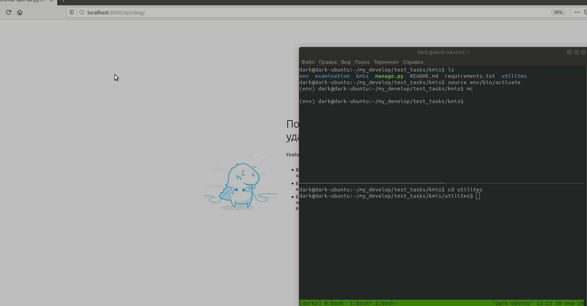

# kmis

# Тестовое приложение для обработки и хранения данных клинической диагностики

Создать окружение и активировать его.
например:
```
python3 -m venv env
source env/bin/activate
```

Установить зависимости

```
pip3 install -r requirements.txt

```
Применить миграции
```
python3 manage.py migrate

```
Запустить
```
python3 manage.py runserver
```
приложение доступно по адресу

http://localhost:8000/api/diag/


проложением есть каталог utilites


в нем исходные файлы для задания и результаты работы скрипта main.py

!!!main.py в данный момент "отказывается" работать в вирт окружении валится с трейсбэком!!!

при запуске main.py отправляется POST на http://localhost:8000/api/diag/

сохраняются image_in_base64code.txt , md5_in image.txt и out_json.json с  требуемым содержимым
в модуле decode.py есть доп. функционал обратного преобразования base64code в изображение out.png:
```
python3 decode.py

```
Пример работы приложения и скрипта:
